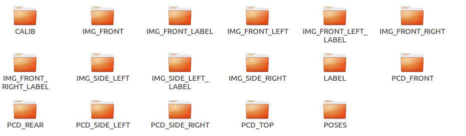

# One time extract all waymo dataset 


## How to use:

```
1.
pip3 install upgrade --pip
pip3 install waymo-open-dataset==1.0.1 --user
pip3 install tqdm

2.download waymo dataset, organize the data as follow
  Root_path:
  	training:
  		segment
  	validation:
  		segment
 
3. python waymo.py Root_path saved_root_path debug(0/1, 0 not debug, 1 debug)

```


## Time consuming:

​	Consuming one week for 1000 segments.

## Quantitives

​	1000 segments, each segments has 200 frames

​	Data Collection Rate: 10HZ

​	Annotated frames  : 10HZ

## Data Collection Setup	

- 1 mid-range lidar, truncated to a maximum of 75 meters
- 4 short-range lidars, truncated to a maximum of 20 meters
- 5 cameras (front and sides)


## Data Organization



```
├── train
│   └── segment-10448102132863604198_472_000_492_000  # segment name
│       ├── CALIB # matrix that convert point in vehicle frame to 5 images
│       │   └── pcd_1521827610479140.txt
│       ├── IMG_FRONT
│       │   └── pcd_1521827610479140.png
│       ├── IMG_FRONT_LABEL	# label in each image
│       │   └── pcd_1521827610479140.txt
image label example:
1 f4b37916-0139-4b2e-ac50-03333d2e466a 1287.8120099999996 711.1703400000001 116.21256000000005 156.00272999999993 0 0
Id  tracking_id x y w l detection_difficulty_level tracking_difficulty_level
│       ├── IMG_FRONT_LEFT
│       │   └── pcd_1521827610479140.png
│       ├── IMG_FRONT_LEFT_LABEL
│       │   └── pcd_1521827610479140.txt
│       ├── IMG_FRONT_RIGHT
│       │   └── pcd_1521827610479140.png
│       ├── IMG_FRONT_RIGHT_LABEL
│       │   └── pcd_1521827610479140.txt
│       ├── IMG_SIDE_LEFT
│       │   └── pcd_1521827610479140.png
│       ├── IMG_SIDE_LEFT_LABEL
│       │   └── pcd_1521827610479140.txt
│       ├── IMG_SIDE_RIGHT
│       │   ├── pcd_1521827610479140.png
│       ├── LABEL # 3D label, in vehicle frame 
│       │   └── pcd_1521827610479140.txt
3d label example:
1  0aMEIc6dImh4rXAoKo24uQ -36.2424 16.959 0.2138 4.4071 2.1558 1.93 2.5371 0.0 0.0 0.0 0.0
Id   tracking_id  x  y z l w h yaw(counterclockwise) velocity_x velocity_y acceleration_x acceleration_y
class id:
    1 vehicle
    2 pedestrian
    3 sign
    4  cyclist
│       ├── PCD_FRONT	
│       │   ├── range1	# points that lidar first time return 
│       │   │   └── pcd_1521827610479140.bin
│       │   └── range2  # points that lidar second time return 
│       │       └── pcd_1521827610479140.bin
│       ├── PCD_REAR
│       │   ├── range1
│       │   │   └── pcd_1521827610479140.bin
│       │   └── range2
│       │       └── pcd_1521827610479140.bin
│       ├── PCD_SIDE_LEFT
│       │   ├── range1
│       │   │   └── pcd_1521827610479140.bin
│       │   └── range2
│       │       └── pcd_1521827610479140.bin
│       ├── PCD_SIDE_RIGHT
│       │   ├── range1
│       │   │   └── pcd_1521827610479140.bin
│       │   └── range2
│       │       └── pcd_1521827610479140.bin
│       ├── PCD_TOP
│       │   ├── range1
│       │   │   └── pcd_1521827610479140.bin
│       │   └── range2
│       │       └── pcd_1521827610479140.bin
│       └── POSES
│           └── pcd_1521827610479140.txt
└── train.txt

```


## Label

3D annotations and 2D annotations are seperated labeled.

3D annotations is in vehicle frame.


## PointCloud Format

  x y z intensity  elongation  is_in_nlz(1 = in, -1 = not in)  + 6(below) , total 12 channels.

- channel 0: camera name
- channel 1: x (axis along image width)
- channel 2: y (axis along image height)
- channel 3: camera name of 2nd projection (set to UNKNOWN if no projection)
- channel 4: x (axis along image width)
- channel 5: y (axis along image height) 

elongation: Lidar elongation refers to the elongation of the pulse beyond its nominal width. Returns with long pulse elongation, for example, indicate that the laser reflection is potentially smeared or refracted, such that the return pulse is elongated in time.

is_in_nlz:  Each scene may include an area that is not labeled, which is called a “No Label Zone” (NLZ). NLZs are represented as polygons in the global frame. These polygons are not necessarily convex. In addition to these polygons, each lidar point is annotated with a boolean to indicate whether it is in an NLZ or not.

Other 6 channels: we provide another 6 channels for lidar to camera projection. The projection method used takes rolling shutter effect into account. each lidar point has it's cooresponding image pixel position. 

Each lidar frame is save as range image in Waymo, I first convert the range image to points, and convert the points to vehicle frame,  and  save the points as (N, 12) bin file, 12 means the above 12 channels. 

When saving points, I follow waymo that throw the points whose range is less than 0.


​	green: in_nlz, red: not_in_nlz

## Calibration

​	For each points, Waymo provide the point's cooresponding coordinate in image, so Waymo direct project lidar points to image plane by the cooresponding coordinate.  Waymo also provide the calibration matrix for image,  I save the calibration matrix as txt, provide a point(x,y,z,1)  P in vehicle frame,  (u,v,1) = calib_matrix * P.

​	Each calibration matrix txt file has 5 rows, from first row to last row, seperate represent FRONT, FRONT_LEFT, FRONT_RIGHT,SIDE_LEFT,SIDE_RIGHT 's calibration matrix, each matrix's shape is (3, 4)

 	


